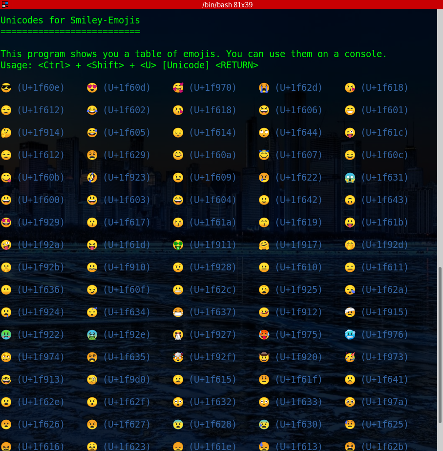

# Emoji-Unicode-Displayer
Shows the Unicode for each Emoji in a console and describes how to display them.

I started this project because I thought it was fascinating to print out Unicode characters
on the console.

